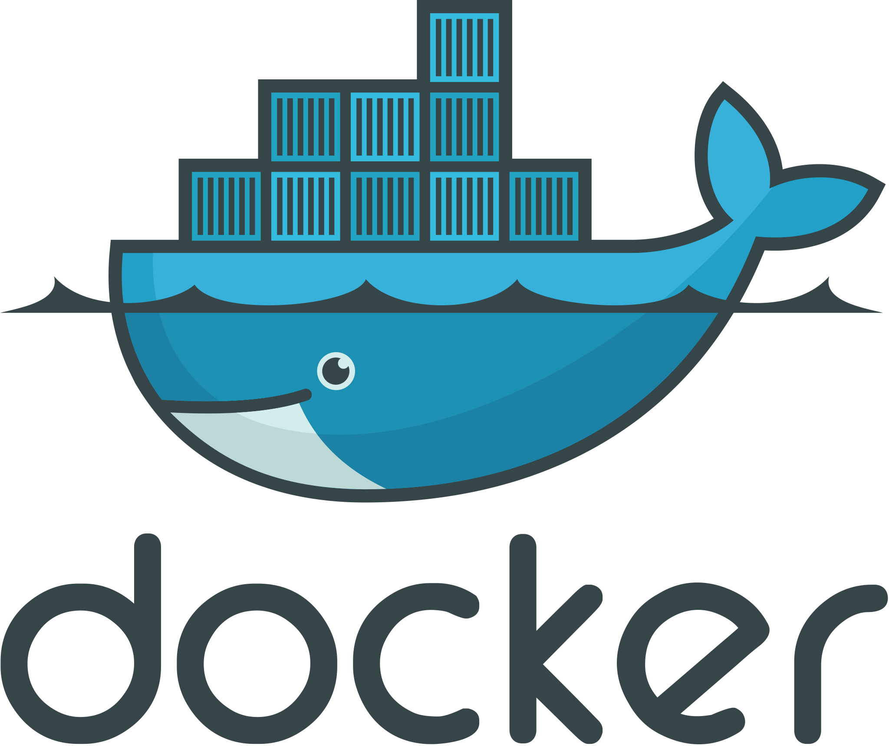
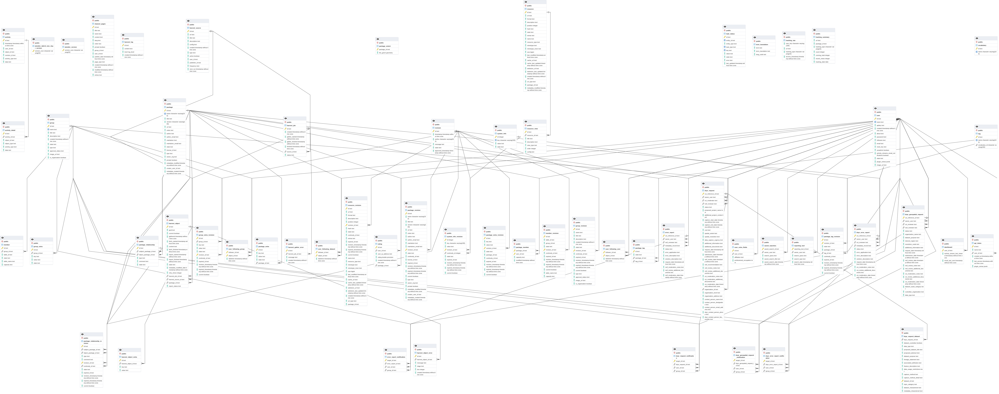

# System Architecture

In this section, we outline the system architecture using ER Diagrams, Software Component Diagrams etc. and key libraries / frameworks used in this project.

## Software Components Used

The following is a list, with brief descriptions, of the key components used in creating this platform. Please refer to their individual documentation for in-depth technical information. ckan, postgres, docker, pycsw and harvester plugins

| Logo | Name | Notes |
|------------|---------|----------------|
|{: style="height:30px"} | [CKAN](https://ckan.org/) | CKAN is an open-source DMS (data management system) for powering data hubs and data portals. CKAN makes it easy to publish, share and use data.|
|{: style="height:30px"} | [Pycsw](https://pycsw.org/) | pycsw allows for the publishing and discovery of geospatial metadata via numerous APIs (CSW 2/CSW 3, OpenSearch, OAI-PMH, SRU), providing a standards-based metadata and catalogue component of spatial data infrastructures.|
| {: style="height:30px"}  |  [Docker](https://docker.com) | Accelerate how you build, share, and run applications. Docker helps developers build, share, and run applications anywhere — without tedious environment configuration or management. |
| {: style="height:30px"}  | [Ckanext-harvest](https://github.com/ckan/ckanext-harvest) | Remote harvesting extension for CKAN. |

## CKAN Components
<!-- 
The following diagram represents the docker containers, ports and volumes that are used to compose this platform.

The docker volumes are used for the following purposes, with the following typical storage allocations:

NAME | CAPACITY | ACCESS | MODES | NOTES
-- | -- | -- | -- | --
media-data | 10Gi | RWX | azurefile | Used for the uploaded files, example for XLS of file of importer. Azurefile and size is sufficient, mostly these files are not big.
redis-data | 10Gi | RWX | azurefile | Used by redis for database backup (to make queue persistence when redis rerun).
static-data | 10Gi | RWX | azurefile | Used for the static files.
 -->

## Data Model

The following diagram represents all of the database entities that are created by PostgreSQL. Right click the image and open it in its own tab to see it at full resolution.

For more details on the relationship between the entities, constraints and higher degree of analysis of the database, please click [here](https://saeoss-portal.vercel.app/)

