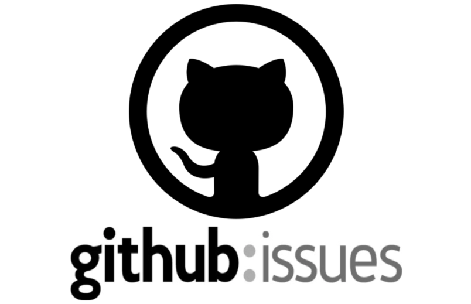
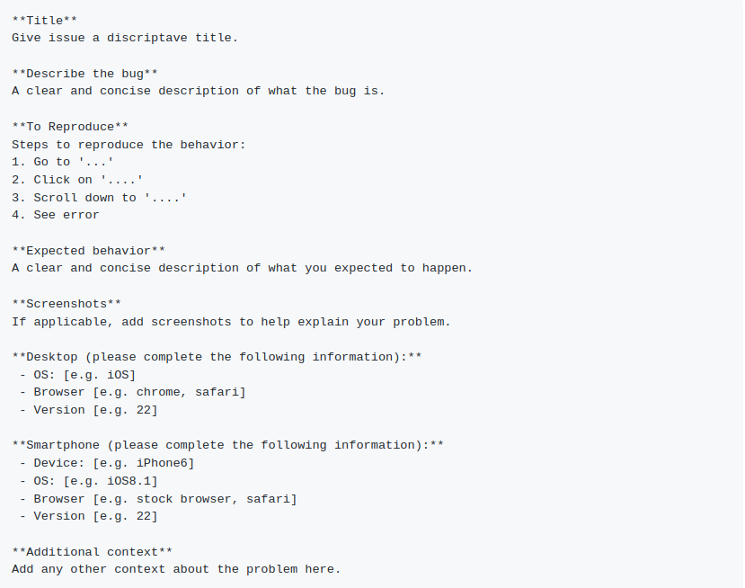
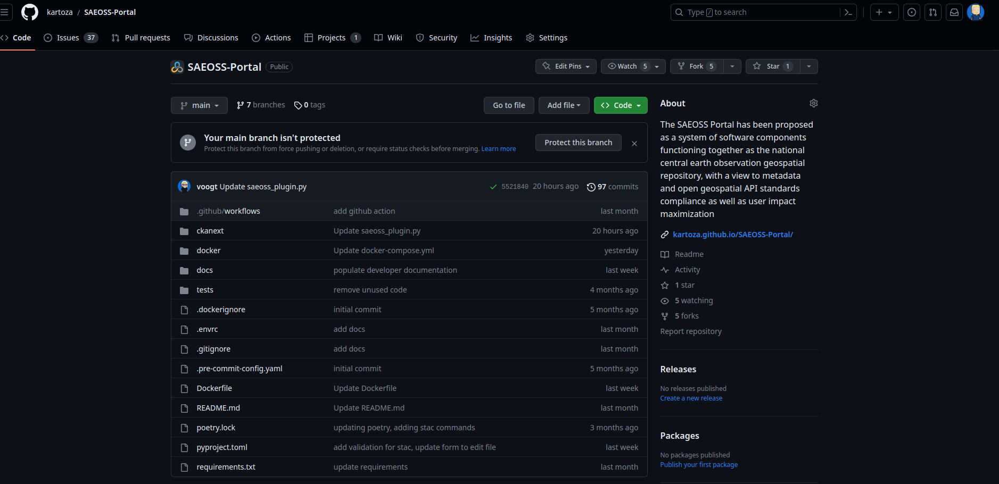
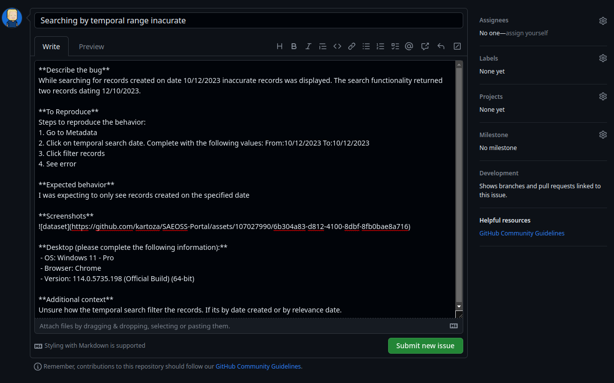
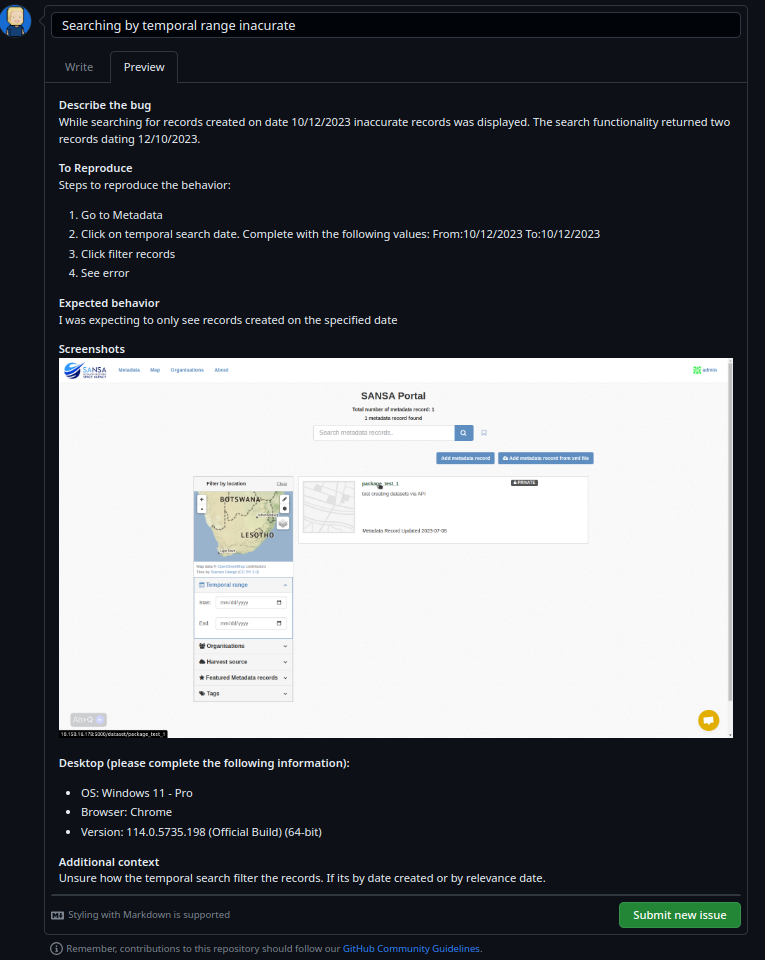

# GitHub Issues/Tickets

This GitHub project repository serves as a project planning and progress tracking platform for the development teams and clients. This repository is public and for anyone to view. The repository can be accessed [here](https://github.com/kartoza/SAEOSS-Portal).

## Tickets

Tickets on the [SAEOSS-Portal GitHub Project Board](https://github.com/kartoza/SAEOSS-Portal/issues) are created first as issues and converted into tickets to work on during the sprint at the SAEOSS-Portal catch-up meeting. This workflow ensures work required by the client gets done as well as allows the opportunity to clear up any doubts as to work that needs to be done. When issues are created, a clear description of what needs to happen is required as well as any accompanying screenshots or videos. If a developer has any doubt, they can simply comment on the ticket, and the creator of the ticket as well as any assigned developers will be notified via email.

## Creating new Github issues/tickets

When encountering a new issue with the platform, it is best practice to create an issue or ticket on the [SAEOSS-Portal GitHub Issues Page](https://github.com/kartoza/SAEOSS-Portal/issues). This ensures developers are made aware of the issue at hand and can work to get the problem fixed as soon as possible.

### Templates

A standard [workflow](#workflow-for-creating-github-issues) for creating tickets is advised to make sure enough information about the problem is related, cutting down on time developers would spend trying to understand the issue at hand.

To ensure this, a general approach has been created to make sure users are able to create a GitHub ticket with as much detail as possible. The following [template](../../developer/guide/templates/bug-report-message-template.md) can be copied and used to create a new ticket.

> 🚩 *GitHub supports various forms of media, including: Markdown syntax, images, and video. All of these can be used to better and more accurately describe your issue. [Read more](https://docs.github.com/en/get-started/writing-on-github/getting-started-with-writing-and-formatting-on-github/basic-writing-and-formatting-syntax)*

### Workflow for creating GitHub issues

To report an issue, users should first access the SAEOSS-Portal [Project Page](https://github.com/kartoza/SAEOSS-Portal). Ensure you are logged in, as users who do not have a GitHub account will not be able to create new issues. If you do not have a GitHub account you can create a [free account](https://github.com/signup?ref_cta=Sign+up&ref_loc=header+logged+out&ref_page=%2F&source=header-home)

1. From the navigation pane select Issues to display all the current GitHub issue tickets. Make sure to study the issues page to determine if the issue has been reported by another user before creating a new issue.
    
    

2. If the issue has not been reported, select the create new button.
    

3. Copy the template and complete the template while taking care to provide as much detail as possible. Remember to add a descriptive title and screenshots.
    

4. Preview the ticket by selecting the preview tab. This will generate the ticket from markdown syntax (if used) and will also display images, giving you a view of what the completed ticket will look like.
    

5. When satisfied, select submit from the green button at the bottom. Your issue has now been created and will appear at the top of the issues with a "#" number assigned to it.

## For developers

### Labels

Tickets have accompanying labels which will be assigned by the development team once reviewing the ticket. These labels aim to give a better description of the type of issue as well as keeping development on track with coordinated effort. During the development of the product some team members can be assigned to deal with only certain types of tickets. The team lead or technical lead on the project will upon reviewing the ticket assign the ticket to the correct team member and also add necessary labels.

Creators of the ticket will be informed of any activity with the ticket via email notification. This includes when tickets have been resolved or being assigned to development team members. Once the ticket has been resolved and closed a final notification will be sent via email stating that the ticket has been resolved/closed.

### Ticket Sizing

Each issue is sized according to its expected time to accomplish. When users report issues they should not add a size label to the ticket as developers will size their own tickets. Labels are rated by size with the following labels:  

| Label | Description |
| :---: | :-----------|
| `[N/A]`  | Applied to issues where size is not applicable. |
| `[1]`  | It's quick I will have this done in about 1 hour.  |
| `[2]`  | Give me 2 hours and I will have it for you.  |
| `[5]`  | It will take between half a day and a full day.  |
| `[8]`  | This is a full-day job.  |
| `[13]`  | I'm going to need about a day and a half to two days.  |
| `[20]`  | It will take at least two to three days.  |
| `[40]`  | This will take a full week.  |

Tickets larger than `SIZE [8]` are usually broken down into smaller tickets/tasks to better display development progress. `SIZE [N/A]` labels are reserved for tasks which are difficult to estimate, like debugging and complex issues.
